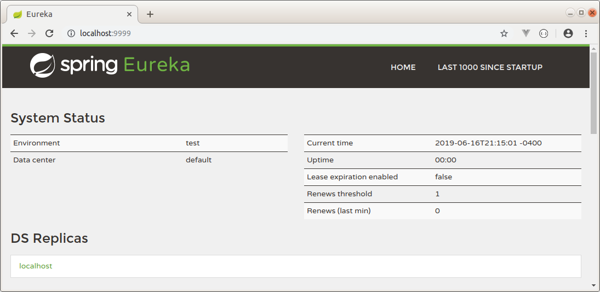
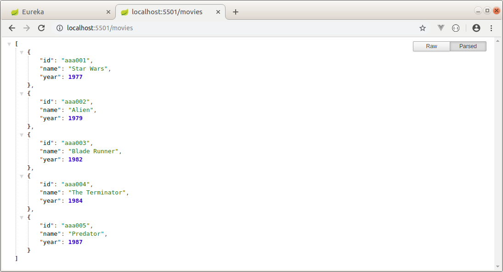
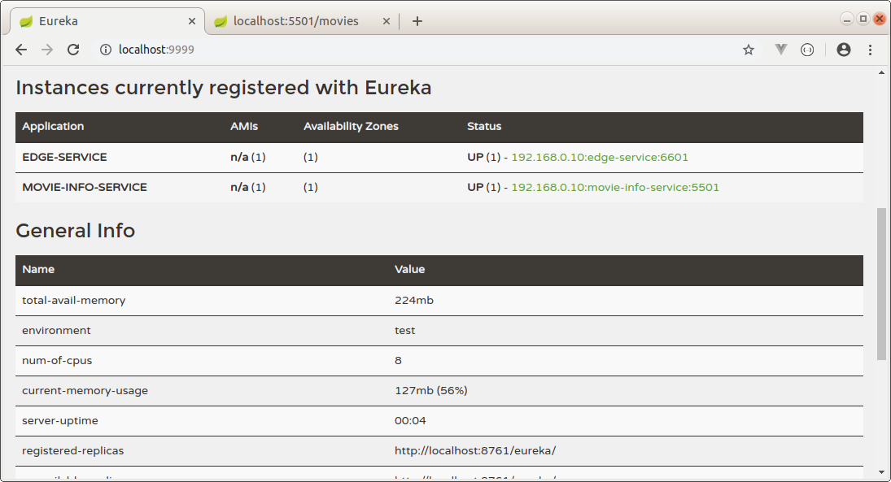
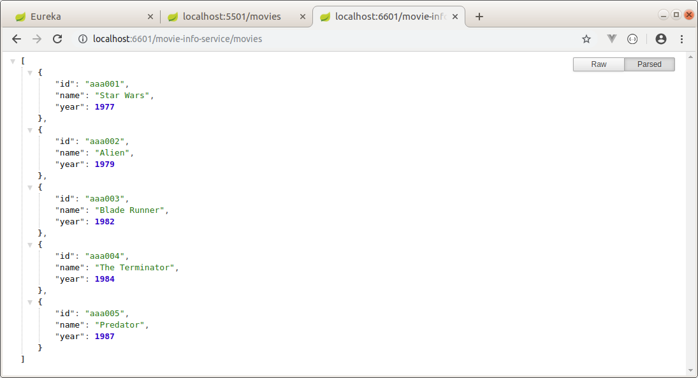

EDGE SERVICE AND EUREKA SERVICE WITH SPRING CLOUD
-----------------------------------------------------------------------------------------------------------------

Microservicios de ejemplo, desarrollados con Spring Boot y Spring Cloud.
Se construye servicio que permite hacer las veces de proxy para acceder a servicio
que retorna informacion de películas.

-----------------------------------------------------------------------------------------------------------------

Se levanta servicio Eureka en el puerto 9999:

-----------------------------------------------------------------------------------------------------------------

Se levanta servicio Movie Info Service en el puerto 5501:

-----------------------------------------------------------------------------------------------------------------

Movie Info Service y Edge Service se registran en el servicio Eureka.

-----------------------------------------------------------------------------------------------------------------

Se llama exitosamente al servicio Movie Info Service por medio del Edge Service:

-----------------------------------------------------------------------------------------------------------------
